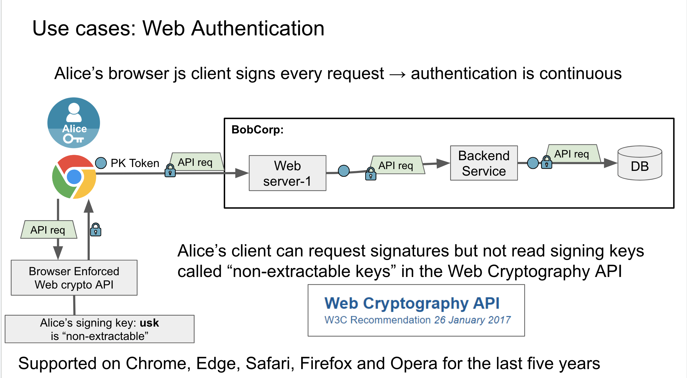

# OpenPubkey Community Meeting

Date: Wednesday, November 15, 2023 - 9AM/12PM PT/ET | [Google Meet Link](https://meet.google.com/oom-qgcz-wsy)

Participants:
* Ann Ming Samborski (BastionZero)
* Lucie Mugnier (BastionZero)
* Ethan Heilman (BastionZero)
* Justin Cappos (NYU/TUF/in-toto)
* Joel Kamp (Docker)
* James Carnegie (Docker)
* David Dooling  (Docker)
* Jonny Stoten  (Docker)
* John Kjell (TestifySec)
* Trishank Kuppusamy (Datadog/TUF/in-toto)
* Marina Moore (NYU/TUF/in-toto)
* Mikhail Swift (Witness)

# Agenda
1. Introductions
2. [Brief overview of OpenPubkey (OPK)](#brief-overview-of-opk)
3. [Getting to version 1.0](#getting-to-version-10)
4. [New use cases for consideration](#new-use-cases-for-consideration)
5. [Any other business (AoB) and questions](#any-other-business-aob-and-questions)

# Meeting Notes

## Brief Overview of OPK
Ethan Heilman briefly covered OpenPubkey. Here are the slides he talked through:

## Getting to Version 1.0

Lucie Mugnier walked through the current thinking on what the plans are to stabilizing the interfaces and "getting to version 1.0."

Two major pieces here: 
1. The Issuance Machine 
2. The Verification Machine

### The Issuance Machine

* The desire is for the Issuance Machine to be interface driven.
* The client, provider, cosigner, and smuggler are defined with the scope of OPK. 
* Put most of the responsibility in the client so that it's very approachable and easy for others to use.

### The Verification Machine

* The provider, verifier, cosigner, and smuggler are OPK's responsibility to define.
* The verifier is limited right now; it only verifies and does not manage refresh or other functions.

### The Dream Pseudocode

### How Do We Accomplish This Reality?

Issues in the [GitHub repo](https://github.com/openpubkey/openpubkey) that are tagged with `v1_requirement` must be resolved in order to achieve stable interfaces. 

We're still working through what a timeline looks like, and we will share that information as soon as we have it. 

### Questions

Question from J. Kjell (thanks to Ethan Heilman for helping me phrase this more clearly): OpenPubkey can be used to generate signatures that you might want to verify into the far future. For instance, I sign a message making a prediction about who will win the world cup. I want people to be able to verify this message in 10 years. Unfortuantely the OpenID Provider (Google, GitHub, etc.) routinely rotates their public keys. If the signature on the ID Token can no longer be verified, then no one can verify the user's public key either. That means after a few weeks no one can prove I actually made that prediction. Docker, for example, needs to solve this problem because they are signing artifacts and posting them on a public repo. People will want to verify those statements years into the future. Docker has a solution were they archive all the old OpenID Provider public keys in a signed object called a TUF. Does OpenPubkey need to support this long lived verification to be considered 1.0? 

    A: 1.0 needs to support the Docker use case. That doesn't mean OpenPubkey by itself needs to support long lived verification, but it needs to have the ability for Docker (or others) to build long lived verification on top of it.

    This also needs to have an issue written for it on GitHub, which Lucie Mugnier is going to take on as an [action item](#action-items).

Question from T. Kuppusamy: what is in and out of scope for v 1.0? Where does JWKS key rotation fall?

    A: What Lucie discussed is a proposal for what v 1.0 requirements are. We very much want input and feedback on what the community wants to see or believes belongs in v 1.0. For this to be a v 1.0 product, we believe it may need to handle OP pubkey rotation. As long as the interface for the ledger exists, then specific implementation can be done as needed.

Question from T. Kuppusamy: have we thought about timestamping the OP signatures?

    A: Yes, Ethan in particular has given this thought. This requirement is driven by use case so it's something that would be considered more seriously when there's a more concrete need.

Question from A. Samborski: how should people add to the `v1_requirements`?

    A: Open an issue in GitHub and tag it with `v1_requirement`. Folks are also welcome to discuss it in the OSSF `#openpubkey` channel.

Remark from J. Carnegie: proposed that handling `kid` for v 1.0 is needed. He will open an issue in GitHub so we can track it as an [action item](#action-items). 

## New Use Cases for Consideration

This topic will have a permanent place on the agenda for new use cases for anyone to come forward to discuss. No use cases for discussion today. 

## Any Other Business (AoB) and Questions

J. Carnegie: how should we deal with missing/non-unique `kid`on JWKS endpoints?
    
    A: J. Carnegie taking an action item to file an issue on this topic.

J. Carnegie: how do we support GitLab OIDC for workloads that don’t support dynamic setting of  ‘aud’? Do we want to attempt to get support through GitLab or work with our own solution?

Additional context to the question: today, you cannot set `aud` dynamically on a per job basis so you cannot set any fields that end up being signed in the ID token (it’s not dynamic). Might be a permissions issue at its core, which could be a large change for GitLab to support. The Audience claim is used to bind the private key of the ephemeral key pair (nonce in the original paper).

In GitLab, workflow receives an ID token with RSA sig. They use that RSA sig for the GQ that does that binding. Once GitLab deletes that RSA sig, they can’t sign anything else. However, that means if there was an ID token with the RSA sig attached to it that you generated through another path, then there's a risk that someone could bind another public key to it.

    A: General consensus was to stick to developing GQ signatures because it provides additional flexibility (beyond GitLab for other providers that may not allow dynamic setting as well). GQ signatures can also include current and past keys so current keys cannot be replayed anywhere else. 

J. Carnegie: is there an interactive OIDC auth anywhere to play with, esp. for dev/demos?
   
    A: There is an existing Google example in the GitHub repo, but there is something there that needs to be fixed (don’t think it’s in the code but it is being actively investigated by Lucie Mugnier). 

    To run, use `go run example.go login` within `/examples/google`
    
    There is also an SSH example that allows you to log in to boxes using OPK.

## Announcements

* Ethan Heilman is giving a talk this Saturday, November 18 at [BSides Cambridge](https://bsidescambridgema.org/)
* Monthly Technical Steering Committee (TSC) meetings will be held on the first Wednesday of the month from 9AM/12PM PT/ET - 10AM/1PM PT/ET. The first TSC meeting will be December 6. Find more details in our [community repo](https://github.com/openpubkey/community#technical-steering-committee-meetings). 

# Action Items

1. James Carnegie to open issue re: 1.0 and `kid`.
2. Jonny Stoten to submit proposal around GQ-only support.
3. Lucie Mugnier to create an issue with the architecture diagrams for v 1.0 that were discussed today.
4. Lucie Mugnier to create an issue tracking long-lived verification.