# OpenPubkey Community Meeting

Date: Wednesday, March 20, 2024 - 9AM/12PM PT/ET | [Google Meet Link](https://meet.google.com/oom-qgcz-wsy)

Participants:
* Ethan Heilman (BastionZero)
* Lucie Mugnier (BastionZero) 
* Ann Ming Samborski (BastionZero)

# Agenda
1. [GitLab CI Support](#gitlab-ci-support)
2. [Solving OP Key Rotation In GitHub Using GitHub Action Commitments](#solving-op-key-rotation-in-github-using-github-action-commitments)
3. [Additional Use Cases](#additional-use-cases)
4. [Any Other Business (AoB) and Questions](#any-other-business-aob-and-questions)

# Meeting Notes

## GitLab CI Support

Ethan Heilman covered the following slides:

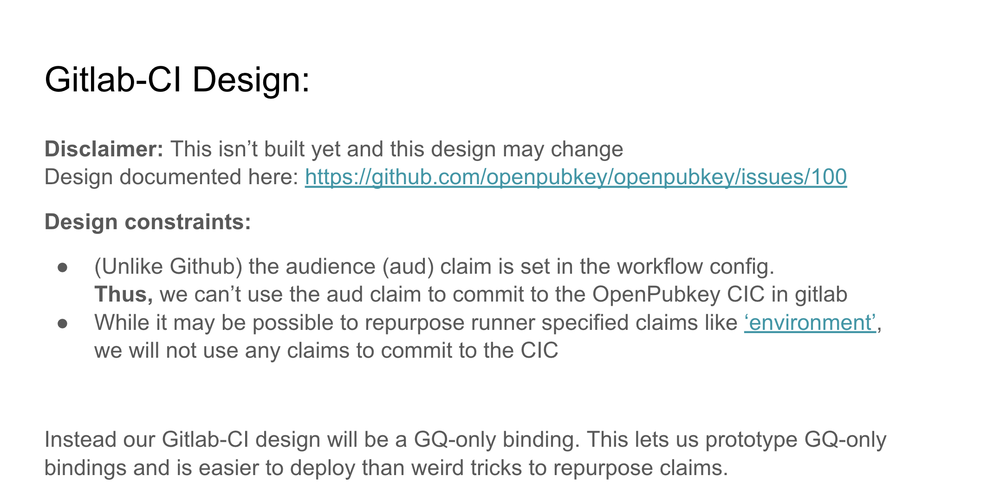

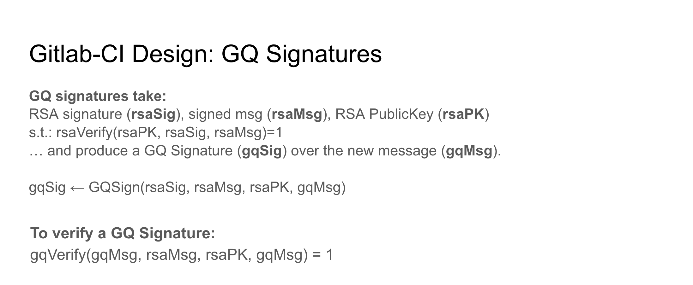

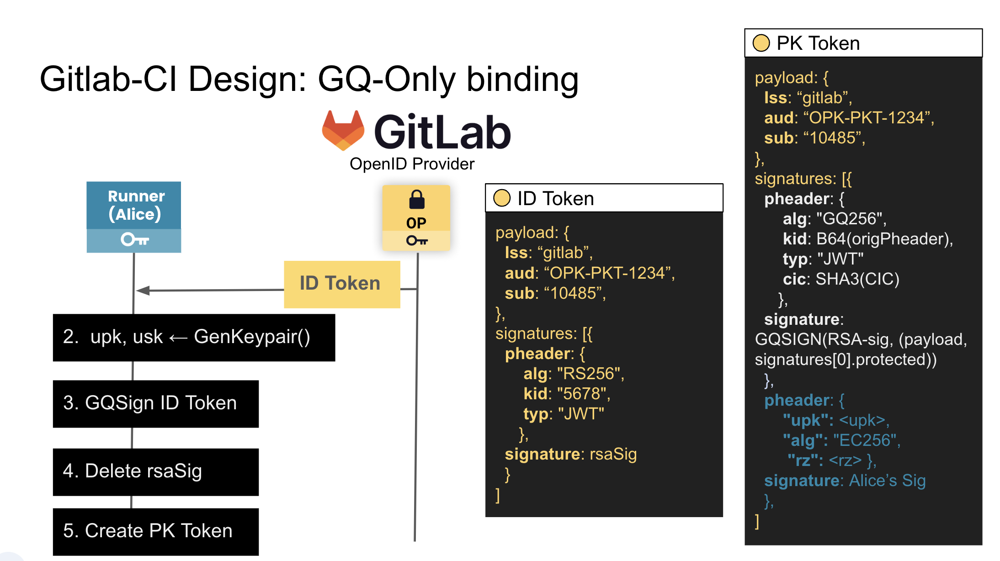

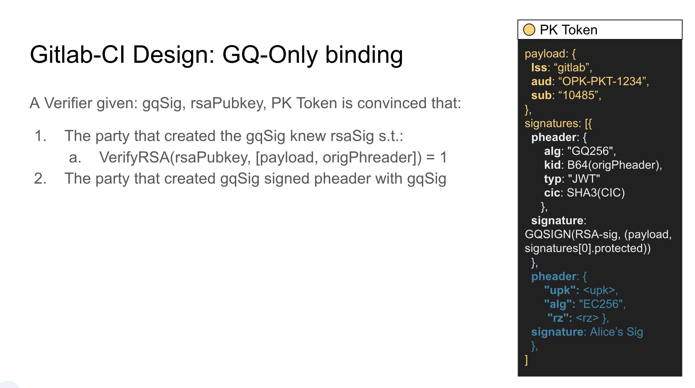

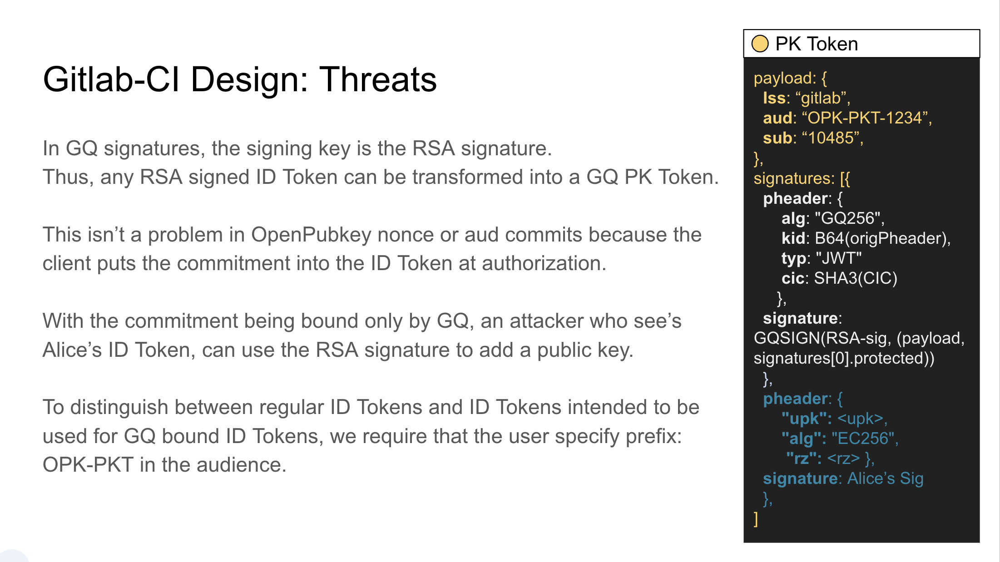

- Unlike GitHub, GitLab does not allow us to set `aud` claim to create a new pubkey every time.
- Using a GQ-only binding, we use the GQ signature to bind the user's commitment public key to the id token.
- You *MUST* delete the RSA signature because for GQ-only bindings, it can be used to geenrate another GQ PK token.
- PR is available as a draft! Find it [here](https://github.com/openpubkey/openpubkey/pull/143). Comments and feedback welcome and encouraged!

## Solving OP Key Rotation In GitHub Using GitHub Action Commitments

*NOTE: The following slides presented by Ethan Heilman are experimental. The community is highly encouraged to review them and provide feedback!*

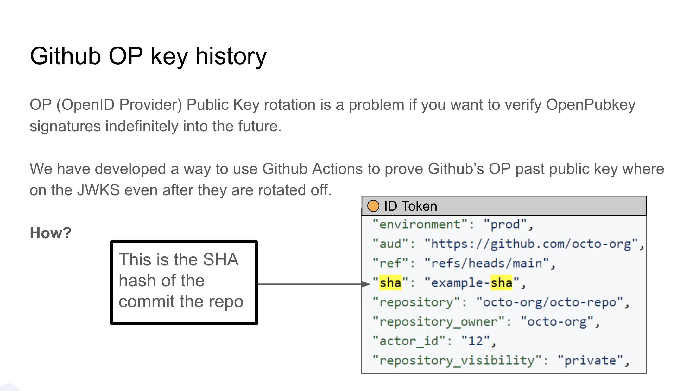

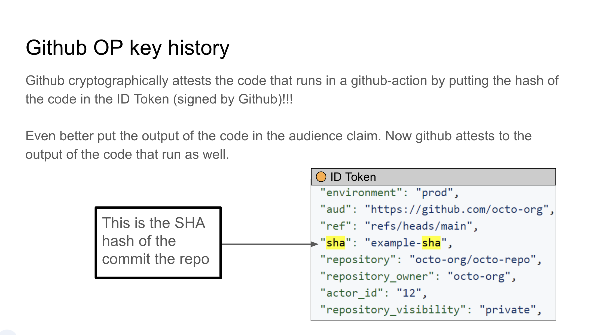

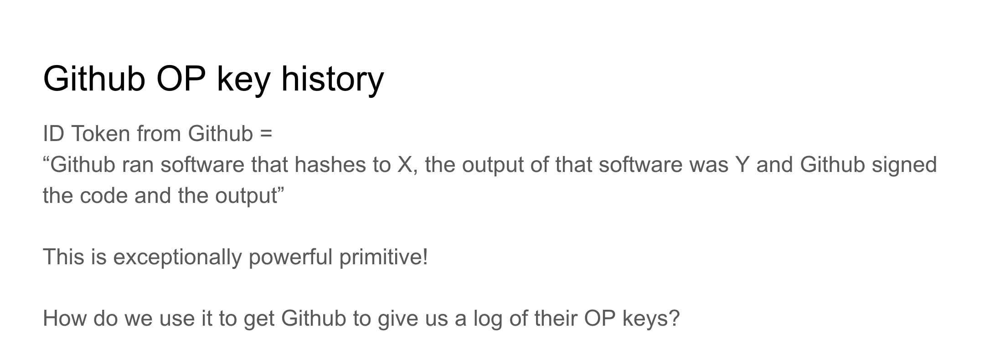

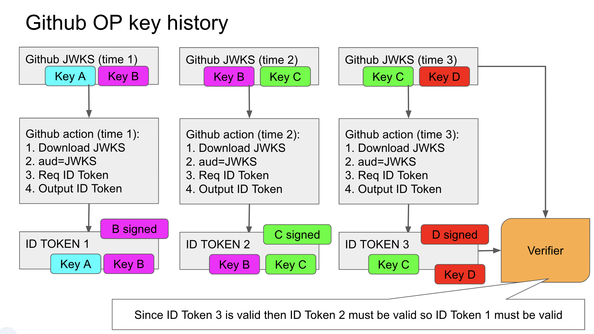

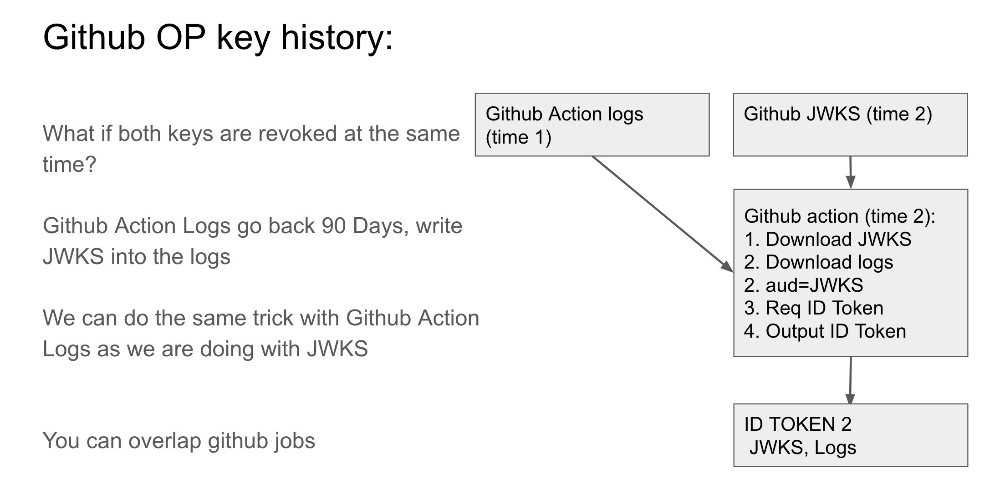

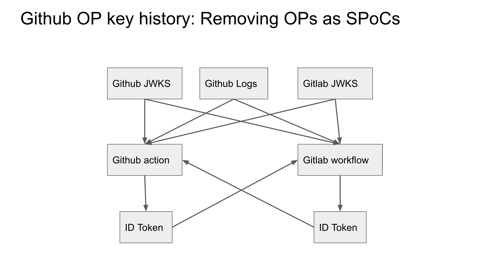

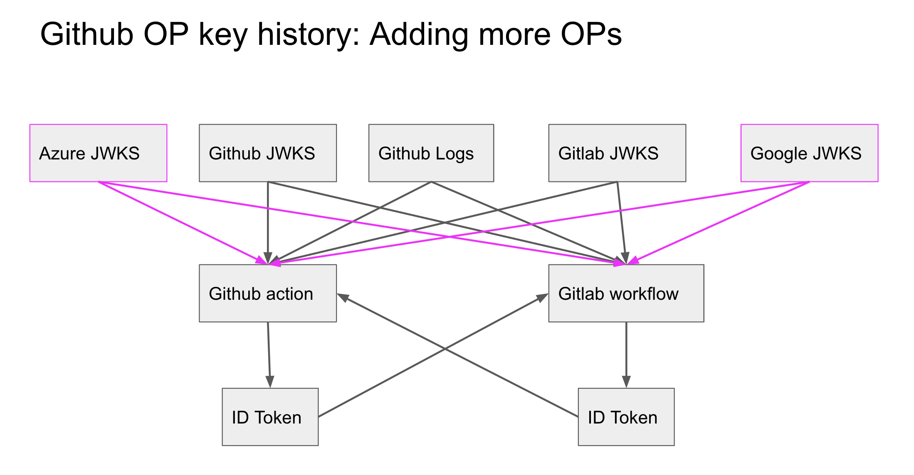

- This proposal doesn't solve where you store this info nor how you distribute it. This deals with removing trust only. 

# Additional Use Cases

No additional use cases were raised during this community meeting. 

# Any Other Business (AoB) and Questions 

* Discussion to continue on the Durable OP Key draft in next month's community meeting. Stay tuned on [Slack](https://openssf.org/getinvolved/) in the `#openpubkey` channel.

# Action Items

No action items were generated from this community meeting.
