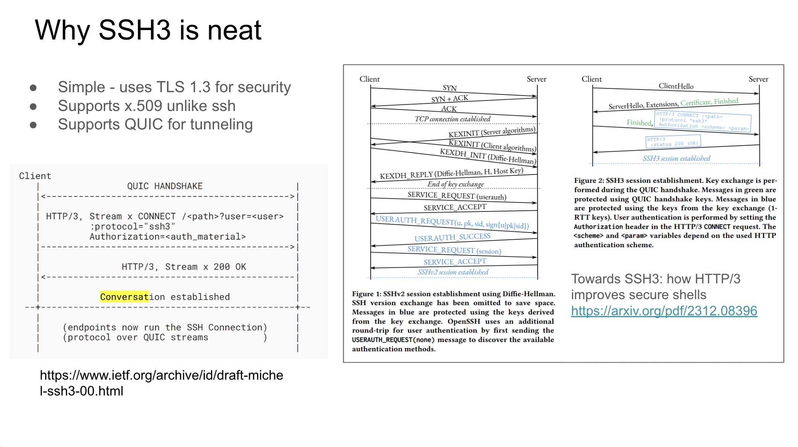
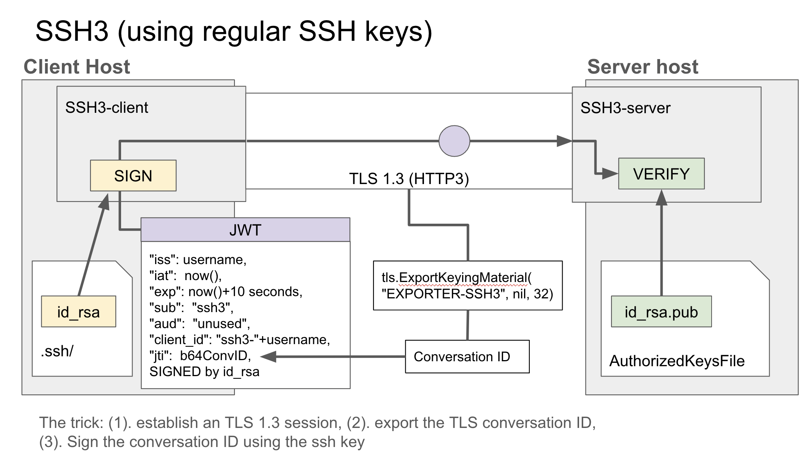
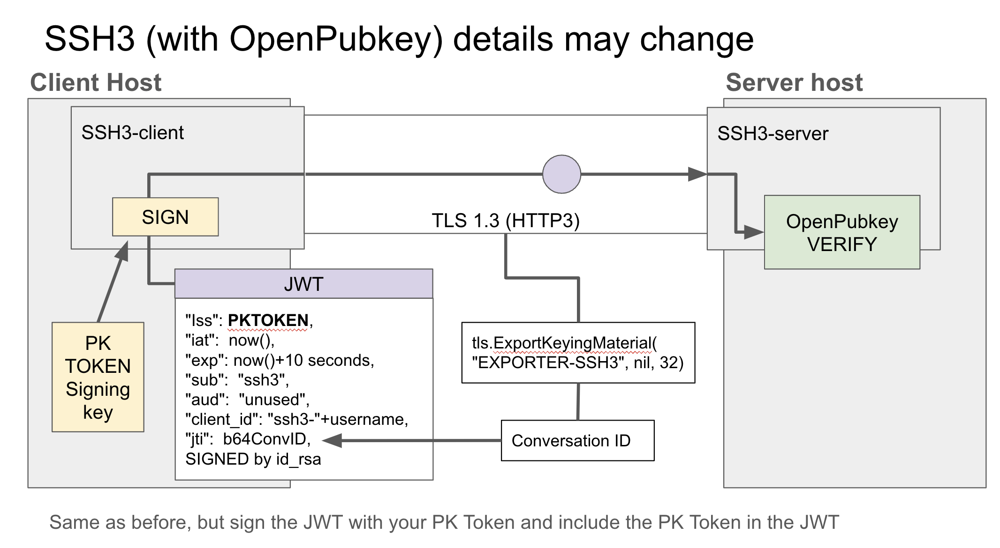

# OpenPubkey Community Meeting

Date: Wednesday, May 15, 2024 - 9AM/12PM PT/ET | [Google Meet Link](https://meet.google.com/oom-qgcz-wsy)

Participants:
* Ethan Heilman (BastionZero)
* Joel Kamp (Docker)
* Trishank Kuppusamy (Datadog)
* Ann Ming Samborski (BastionZero)

# Agenda
1. [OpenPubkey in SSH3](#ssh3)

# Meeting Notes

## SSH3

Ethan took us through a short slide deck discussing the benefits of SSH3. 

Note that SSH3 is still in development and is not in a place at present to be used in production.

For more details on thoughts around incorporating SSH3 into OpenPubkey, see [issue 145](https://github.com/openpubkey/openpubkey/issues/145).

## Additional Use Cases

## Any Other Business (AoB) and Questions

# Action Items

No action items were generated from this community meeting.
