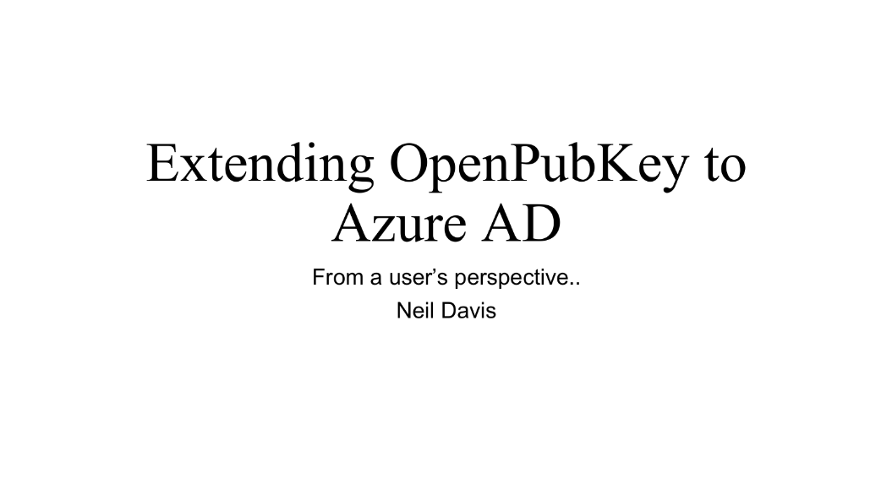
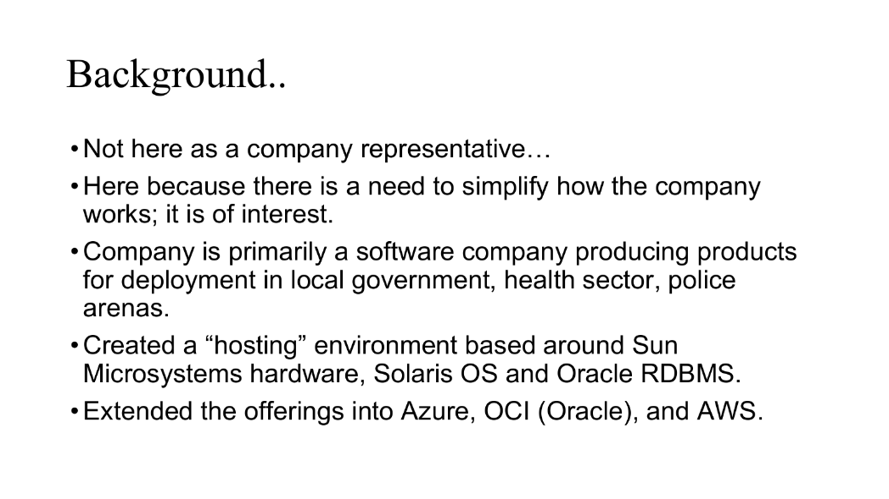
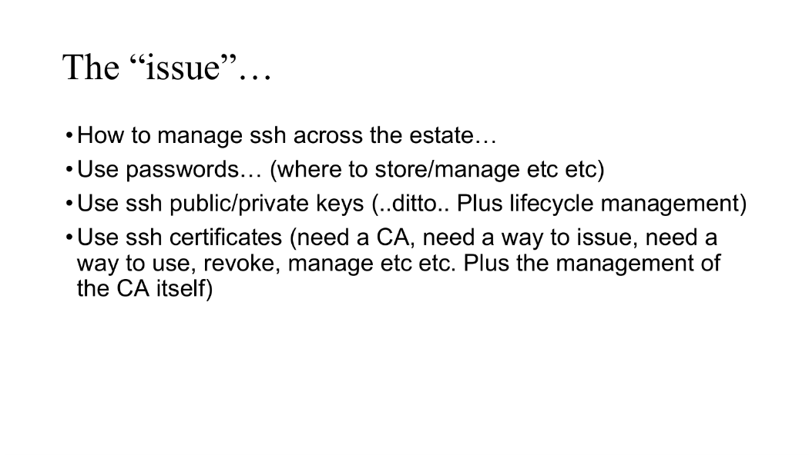
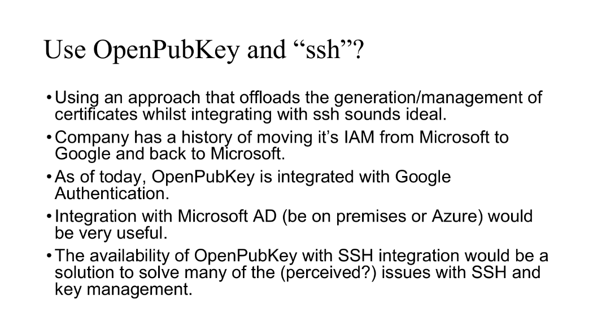

# OpenPubkey Community Meeting

Date: Wednesday, September 18, 2024 - 9AM/12PM PT/ET

Participants:
* Ethan Heilman - CloudFlare
* Jonny Stoten - Docker
* Eldo Varghese - PlosOne
* Neil Davis - NEC?

# Agenda

* Neil Davis will talk about OpenPubkey usecases
* Eldo Varghese will talk about another OpenPubkey usecase
* Ethan Heilman will give a brief update of OpenPubkey in SSH3 (https://github.com/francoismichel/ssh3/pull/146)

# Meeting Notes

## Neil Davis presents his usecase "Extending OpenPubkey to Azure AD"

- Not representing a company, representing himself
- Interested in exploring the possibilities before presenting to company. Company builds software for local government, healthcare, police. Started doing hosting.
- Hosting platform built on oracle, solaris OS.
- Started to explore other platforms they can run on. Oracle offers a good deal. Looked into oracle OCI (Oracle Cloud Infrastructure). 
- We build on the OCI services

- "Why I am intersted?"
- Moving away from Solaris, moving to linux. That is where the problem starts. What we tend to find is people standup linux machines create their own passwords, people send the password around, people forget passwords and need then reset. Wants to move away from passwords.
- Those of us more savy use SSH with public keys. Public key management is tricky.

- It was suggested we could use SSH certificates where we setup a CA. Most of those solutions require that they use another command other than SSH. Another negative is that we have to manage our own CA, something like hashicore vault.
- Stumbled across OpenPubkey from Docker.
- Heck I could just have configuration on my service. Authorization could be done by a third party. Don't have to worry about people forgetting passwords.
- Antoher positive, it will hide the SSH cert creation, that is when I asked the question can it be extended to work with Azure?
- My ask would be to extend OpenPubkey to auth with Azure

Ethan's questions:
- When you talk about running a different command? Is running the command to create cert ok and then running ssh to connect?
    - Neil: ideally behind the scenes, it creates SSH certificate using a PAM plugin. That said, having to run opk login to generate the cert is not a big show stopper. What is really important that there is something like Azure that is acting as the authorization layer.
    - Neil: When i looked at hashicorp vault. I could issue a cert for three hours. Our security working group would fight very hard against this because, they would say "once you logged in, you shouldn't have to log in again".
    - Neil: Looking to make life easier for myself and my colleagues. There are lots of things with SSH today that they complain about that would go away with OpenPubkey.

## Eldo's usecase

We are a small academic publisher PLOS.org. On the backend we have multiple vendors that handle the manuscript process. For instance a typesetting vendor. We are trying to get away from the model of sftp that is single username and password per vendor.

A vendor pushes or pulls the file at each step of the review process. They have been using a single username and password. If an employee at the vendor leaves, they still have access to the sftp servers because they know that password.

(Ethan-note: the issue is that passwords are not per user, but per vendor, so everyone who works at the vendor can learn that password)

We are moving forward with the new vendor. We asked them "are you ok with SSO?Talked about doing things like a bastion server, a virtual desktop environment, IP whitelisting. They weren't the biggest fans of that. They wanted to do some sort of SSO system that is client agnostic. One employee at the vendor might want to to use sftp at the commandline, another wants a GUI sftp app.

To do this, we looked at teleport and some of these peer applications to teleport. What really liked about openpubkey is the open source nature, the ssh certificates, the clean implementation...

With the help of Ethan, the implementation was done in a week or so. The issues happened within windows. With linux, osx everything just worked great. It was when we started testing in windows, we ran into trouble. Ethan helped us troubleshoot the issues. Filezilla, putty and these other tools don't handle SSH certificates. Putty supports it in the newer version. In my most commonly used versions, it is not supported in Putty. It bit us in that it took use how long it took us to get it working.

We were finally able to find an OSS FS project equivalent to replace filezilla. This let us  meet the vendors needs on windows.

Q4 will be will able to go into production with OpenPubkey.

Microsoft embracing some of these more standardized approaches, using SSH, using linux system, they have a built in sftp client. That is how we fianlly tested this does work in windows.

Opensource filezilla replacement that works with SSH cert and OpenPubkey.

We used sshfs-win (github.com/winfsp/sshfs-win) which is part of win-ssh project (https://github.com/winfsp). win-ssh is a FUSE replacement for windows. Uses SSH as the transport. Fuse lets you have this virtual file systems. This is a windows version of that.

There was also sshfs-win-manager (https://github.com/evsar3/sshfs-win-manager)

Ethan: Other than Google, what other SSOs are you interested in?

Eldo: We are good to go. Our vendor uses Gsuite/Google internally.

Ethan: Anything that OpenPubkey could do better?

Eldo: Packaging, it would great if we had it as an ubuntu packages, fedora repos, just so it is easier for linux sys admins to type in a command and have it working. Install via apt or yum

I definately want to work on that in OpenPubkey. Not sure of the timeline. End of November-ish I want to put in some work. 

Ethan: PRs are always appreciated. That would be very valuable to the project.

Eldo: We are really appreciative of this project

## Etah OpenPubkey in SSH3 update

Ethan gives brief update on OpenPubkey PR to SSH3. PR is out of draft, being reviewed.

Meeting ends at 12:55pm (ET)

## Additional Use Cases

## Any Other Business (AoB) and Questions

# Action Items